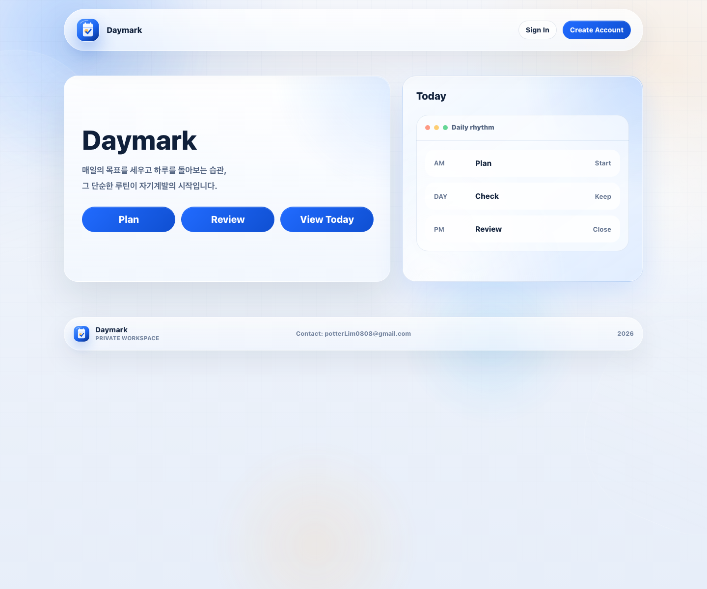
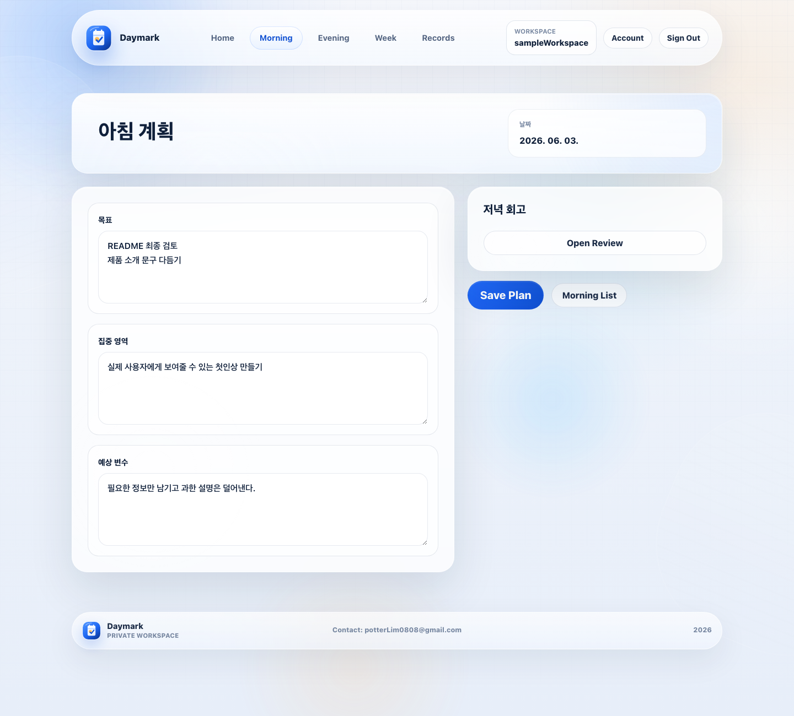
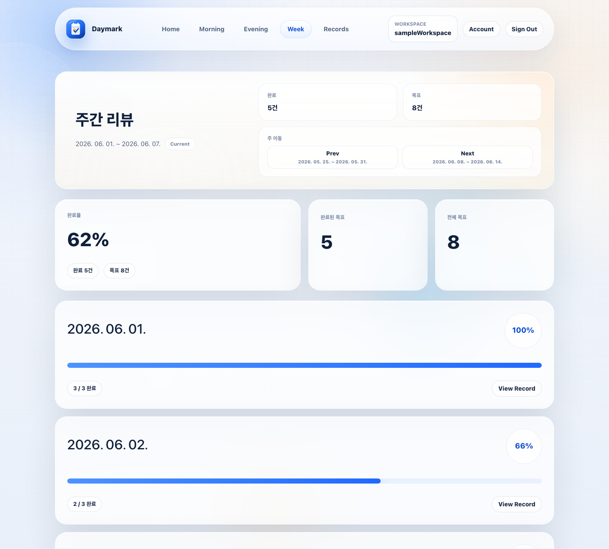

# Daymark

Daymark는 매일의 계획과 회고를 한곳에 정리하는 Spring Boot 기반 웹 애플리케이션입니다.

아침에는 오늘의 목표와 집중 기준을 세우고, 저녁에는 실행 결과를 체크합니다. 쌓인 기록은 주간 흐름, 기록 라이브러리, Markdown/PDF 내보내기로 다시 확인할 수 있습니다.

## 화면



| 작성 | 개인 주간 리뷰 |
| --- | --- |
|  |  |

## 주요 기능

- `Morning Plan`: 목표, 집중 영역, 예상 변수를 날짜별로 기록합니다.
- `Evening Review`: 아침 목표를 체크리스트로 확인하고 성과와 개선점을 남깁니다.
- `Weekly Review`: 월요일부터 일요일까지의 루틴 흐름과 목표 완료율을 봅니다.
- `Records`: 날짜 범위와 키워드로 장기 기록을 탐색합니다.
- `Export`: 선택한 기록을 Markdown으로 다운로드하거나 PDF 저장용 보고서로 확인합니다.
- `Account`: Google 계정 확인 후 Workspace ID와 비밀번호를 관리합니다.
- `Operations`: 관리자 전용 화면에서 Workspace 성장, 루틴 수행, 목표 완료, 내보내기, 로그인 흐름을 확인합니다.

## 기술 스택

- Java 17
- Spring Boot 3.5
- Spring MVC, Thymeleaf
- Spring Security, OAuth2 Client
- Spring Data JPA
- Flyway
- MySQL
- H2
- Gradle

## 로컬 실행

로컬 프로필은 H2 메모리 데이터베이스를 사용합니다.

```bash
./gradlew bootRun --args="--spring.profiles.active=local"
```

접속 주소:

```text
http://127.0.0.1:8080
```

Google 로그인까지 확인하려면 Google OAuth 클라이언트를 만든 뒤 환경 변수를 설정합니다.

```bash
export GOOGLE_CLIENT_ID="your-google-client-id"
export GOOGLE_CLIENT_SECRET="your-google-client-secret"
```

로컬 redirect URI:

```text
http://127.0.0.1:8080/login/oauth2/code/google
http://localhost:8080/login/oauth2/code/google
```

## 테스트와 빌드

```bash
./gradlew test
```

Docker가 준비되어 있다면 MySQL 통합 테스트도 실행할 수 있습니다.

```bash
./gradlew mysqlIntegrationTest
```

테스트, Checkstyle, 공개 저장소 위생 검사, 커버리지 리포트까지 함께 확인하려면 다음 명령을 사용합니다.

```bash
./gradlew check
```

커버리지 리포트:

```text
build/reports/jacoco/test/html/index.html
```

배포용 JAR:

```bash
./gradlew bootJar
```

생성 파일:

```text
build/libs/daymark.jar
```

## 환경 변수

기본 프로필은 MySQL과 보안 값을 요구합니다.

| 환경 변수 | 설명 |
| --- | --- |
| `DAYMARK_PUBLIC_BASE_URL` | 공개 HTTPS 주소 |
| `DATABASE_URL` | MySQL JDBC URL |
| `DATABASE_USERNAME` | MySQL 사용자 |
| `DATABASE_PASSWORD` | MySQL 비밀번호 |
| `DAYMARK_REMEMBER_ME_KEY` | remember-me 서명 키 |
| `GOOGLE_CLIENT_ID` | Google OAuth 클라이언트 ID |
| `GOOGLE_CLIENT_SECRET` | Google OAuth 클라이언트 secret |

실제 secret 값은 저장소에 커밋하지 않습니다. `.env.example`과 `ops/aws/ecs-express-env.example`에는 예시 값만 둡니다.

## 프로젝트 구조

```text
src/main/java/com/potterlim/daymark
├─ config
├─ controller
├─ dto
├─ entity
├─ repository
├─ security
├─ service
└─ support
```

주요 데이터는 `user_account`, `daymark_entry`, `operation_usage_event`, `weekly_operation_metric_snapshot` 테이블에 저장됩니다. 날짜별 기록은 하나의 Markdown 문자열이 아니라 섹션별 텍스트로 저장하고, 미리보기와 내보내기 화면에서 다시 조합합니다.

## 문서

- [문서 안내](docs/README.md)
- [프로젝트 구조](docs/project-architecture.md)

## 저장소 관리

- 로그, 캡처, 내보내기 결과물, DB dump, 실제 운영 secret은 Git에 포함하지 않습니다.
- 배포와 운영 인수인계 문서는 로컬 전용 문서로 관리합니다.
- 공개 문서는 현재 코드와 제품 흐름을 기준으로 유지합니다.
